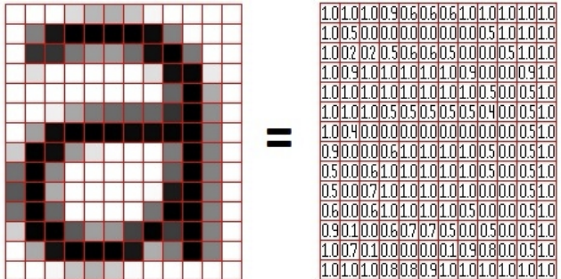

# SVD-Based Handwritten Digit Classification

This project explores the classification of handwritten digits using Singular Value Decomposition (SVD). A labeled training set builds the classifier, and a separate test set evaluates its accuracy—mirroring applications like automatic zip code recognition.

## Background
Handwritten digit images are grayscale matrices where each entry is a pixel’s brightness. Here, each image is a 28×28 matrix (flattened into a 784-dimensional vector). For each digit d = 0, …, 9, training images are stacked as columns of a matrix—enabling efficient linear-algebra operations like SVD.

A grayscale image can be represented by a $p \times q$ matrix $M$ whose $(i,j)$ entry is the brightness at pixel $(i,j)$.

Each image is a flattened vector of size $28^2 = 784$, i.e., a $28 \times 28$ matrix. For example, for a matrix $C \in \mathbb{R}^{3\times 3}$:

$$
C=
\begin{bmatrix}
c_{11} & c_{12} & c_{13} \\
c_{21} & c_{22} & c_{23} \\
c_{31} & c_{32} & c_{33}
\end{bmatrix}
\xrightarrow{\text{stack columns}\qquad\qquad}\qquad\qquad
\begin{bmatrix}
c_{11}\\
c_{21}\\
c_{31}\\
c_{12}\\
c_{22}\\
c_{32}\\
c_{13}\\
c_{23}\\
c_{33}
\end{bmatrix}
$$

For each digit $d$, the training set consists of $n$ handwritten digits. Define the matrix $A_d$ whose columns are the training images of type $d$; $A_d \in \mathbb{R}^{784 \times n}$:

$$
A_d =
\begin{bmatrix}
\vdots & \vdots & \cdots & \vdots \\
\text{Image }1 & \text{Image }2 & \cdots & \text{Image }n \\
\vdots & \vdots & \cdots & \vdots
\end{bmatrix}.
$$

## SVD-based classification

Training columns for one digit lie in a low-dimensional subspace.

$$
A \in \mathbb{R}^{784 \times n}, \qquad A = U\Sigma V^{\mathsf T}.
$$

The columns of $U$ form an orthonormal basis for the column space of $A$, so any image of that digit is well approximated by a linear combination of a few leading columns of $U$.

We have

$$
A = U\Sigma V^{\mathsf T} = \sum_{j=1}^{m} \sigma_j\,u_j v_j^{\mathsf T},
$$

thus the $\ell$-th column of $A$ (the $\ell$-th training digit) can be represented as

$$
a_\ell = \sum_{j=1}^{m} (\sigma_j v_{j\ell})\, u_j
$$

which means that the coordinates of image $a_\ell$ in terms of the orthonormal basis are

$$
a_\ell = \sum_{j=1}^{m} x_j u_j = Ux.
$$

Solving the least-squares problem

$$
\min_{x} \lVert Ux - a_\ell \rVert_2
$$

yields the optimal vector with entries

$$
x_j = \sigma_j v_{j\ell} \quad (j=1,\ldots,m),
$$

and zero residual.

Columns of $A$ are variations of the same digit, so they’re nearly linearly dependent → a low-dimensional subspace. The leading columns of $U$ (“singular images” $u_1,u_2,\ldots$) capture this subspace.

Use a rank $k$ ($k \ll m$) model: each $a_\ell$ is well-approximated in the subspace spanned by $\{u_1,\ldots,u_k\}$ with a small least-squares residual.

For a test digit $\delta \in \mathbb{R}^{784}$, compare its fit to each digit’s $k$-dimensional subspace $U_k^{(d)}$ (equivalently, solve)

$$
\min_{x} \lVert U_k^{(d)} x - \delta \rVert_2
$$

and predict the label with the smallest residual.

### SVD classifier — steps
1. For each digit $d\in\{0,\dots,9\}$, stack its training images as columns of $A^{(d)}$.
2. Compute the SVD of $A^{(d)}$ and keep the first $k$ left singular vectors $U_k^{(d)}$.
3. For a test image $\delta$, compute the residual to each class subspace and predict the digit with the smallest residual.

## Task 2
Compute the SVD for digits 3 and 8 (each $784\times 400$) and analyze results.

### Method
Stack 400 training images per digit to form each matrix. Apply SVD, plot singular values (linear scales), and visualize the first three singular images $(u_1,u_2,u_3)$ for each digit.

### Goal
Assess how well each digit fits a low-dimensional subspace, compare singular value decay, and interpret singular images as prototypes/variations within each class.

## Task 3
Implement an SVD-based digit classifier using 400 training images per digit (ten $784\times 400$ matrices) and evaluate on 40,000 labeled test images.

### Method
1. **Train bases:** For each digit $d$, build $A_d$ and keep the top-$k$ left singular vectors $U_k$ for $k=5,\ldots,15$.
2. **Classify:** For each test image, project onto each $U_k$ and choose the digit with the smallest projection residual (Euclidean norm).
3. **Evaluate:** Test all 40,000 images against `TestLabels.npy` and report per-digit accuracy for each $k$.

Quantify how performance depends on $k$, note which digits benefit from smaller vs. larger $k$, and verify against reference results.

## Files & Structure
- `TrainDigits.npy`, `TrainLabels.npy`: Training data and labels (10 classes)  
- `TestDigits.npy`, `TestLabels.npy`: Test data and ground truth (note: large files)  
- `svd_classifier.py`: Main Python script implementing the classifier  
- `README.md`: This file

