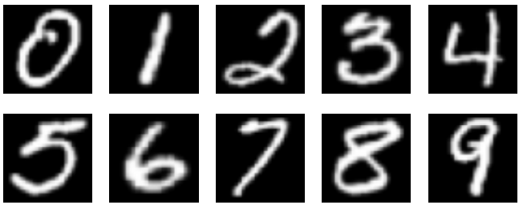

# SVD-Based Handwritten Digit Classification

This project explores the classification of handwritten digits using Singular Value Decomposition (SVD). A labeled training set of digits is used to develop the classification algorithm, while a separate test set evaluates its accuracy. The work serves as a hands-on exercise in pattern recognition, similar to real-world applications like automatic zip code recognition.

## Background
Handwritten digit images are represented as grayscale matrices, where each entry corresponds to a pixel’s brightness. In this project, each digit is stored as a 28×28 matrix (flattened into a 784-dimensional vector). For each digit d=0,1,…,9 the training data is organized into a matrix where each column represents one training image of that digit. This structure allows for efficient use of linear algebra methods, such as SVD, in classification.

here is a sample of numbers form 0-9, 

An image in grayscale can be represented by a p × q matrix M whose (i, j)-th entry
corresponds to the brightness of the pixel (i, j). The storage of this matrix requires pq
locations. See Figure 2 for an example.

In your data sets, each image is a flattened vector of size 282 = 784 which corresponds to
a 28 × 28 (p = 28 and q = 28) matrix. For example, for a matrix C ∈ R
3×3 we would have

$$
C=
\begin{bmatrix}
c_{11} & c_{12} & c_{13} \\
c_{21} & c_{22} & c_{23} \\
c_{31} & c_{32} & c_{33}
\end{bmatrix}
\;\xrightarrow{\text{stack columns}\qquad\qquad}\qquad\qquad
\begin{bmatrix}
c_{11}\\
c_{21}\\
c_{31}\\
c_{12}\\
c_{22}\\
c_{32}\\
c_{13}\\
c_{23}\\
c_{33}
\end{bmatrix}
$$

For each kind of digit d, where d = 0, 1, . . . , 9, the training set consists of n handwritten
digits. We refer to them as training images for digit d. We now define the matrix Ad, where
the columns of Ad are the training images of type d. Thus Ad is a m × n matrix, with
m = 784:

$$
A_d =
\begin{bmatrix}
\vdots & \vdots & \cdots & \vdots \\
\text{Image }1 & \text{Image }2 & \cdots & \text{Image }n \\
\vdots & \vdots & \cdots & \vdots
\end{bmatrix}.
$$

Usually, n ⩾ m although the case n < m is also possible. We refer to the matrix Ad
as the training matrix for digit d. So, we have a total of 10 training matrices Ad, each
corresponding to one of the digits d = 0, 1, . . . , 9.

## Task 2
For the digits 3 and 8, each represented by a training matrix of size 784×400, the task was to compute the singular value decomposition and analyze the results.

### Method
The matrices were formed by stacking 400 training images of each digit. The SVD was then applied to both matrices, and the singular values were plotted on linear scales to study their decay. In addition, the first three singular images (u1, u2, u3) were visualized for each digit to illustrate the most significant patterns captured by the decomposition.

### Goal
The purpose of this task was to investigate how well the digits can be represented in a low-dimensional subspace, to compare differences in singular value decay between the two digits, and to interpret the singular images as prototypes and systematic variations within each class.

## Task 3
Implement an SVD-based digit classifier using 400 training images per digit (ten matrices of shape 784×400) and evaluate it on the full test set of 40,000 images with known labels.

### Method
1. Construct one training matrix A_d for each digit d ∈ {0,…,9} by stacking 400 flattened 28×28 images as columns (shape 784×400).  
2. For each A_d, compute its SVD and form a rank-k basis U_k from the first k left singular vectors (k ∈ {5,6,…,15}).  
3. For every test image δ, compute the residual against each digit’s subspace:  
   \[
   r_d(δ, k) = \| (I − U_k U_k^T) δ \|_2
   \]  
   Classify δ as the digit with the smallest residual.  
4. Compare predictions with `TestLabels.npy` and report accuracy (%) per digit for each k ∈ {5,…,15}.  

### Goal
Quantify how performance depends on the subspace dimension k, identify which digits benefit from smaller vs. larger k, and validate the implementation by matching (within reasonable variance) the reference results from the notes.

## Files & Structure
- `TrainDigits.npy`, `TrainLabels.npy`: Training data and labels (10 classes).  
- `TestDigits.npy`, `TestLabels.npy`: Test data and ground truth.
- Both of the above files are > 25MB and cannot be uploaded. 
- `svd_classifier.py`: Main Python script implementing the classification algorithm.    
- `README.md`: This file.  

## Some Comments
- **Data layout**  
  Training: build A_d ∈ R^{784×400} per digit d by stacking 400 column vectors.  
  Test: keep X_test ∈ R^{784×M} (M = 40,000) for vectorized evaluation.  

- **Precompute once**  
  For each d, compute economy SVD: A_d = U_d Σ_d V_d^T.  
  Cache U_d[:, :k_max] with k_max = 15. Slice for k ∈ {5,…,15}.  

- **Residual-based classification**  
  For given k and digit d: P_d = U_{d,k} (U_{d,k}^T X_test).  
  Residuals: R_d = ||X_test − P_d||_2 (columnwise).  
  Stack all R_d rows → R ∈ R^{10×M}, predict with argmin over rows.  

- **Efficiency**  
  Use matrix–matrix operations; avoid per-sample loops.  
  Consider batching test columns if memory is tight.  
