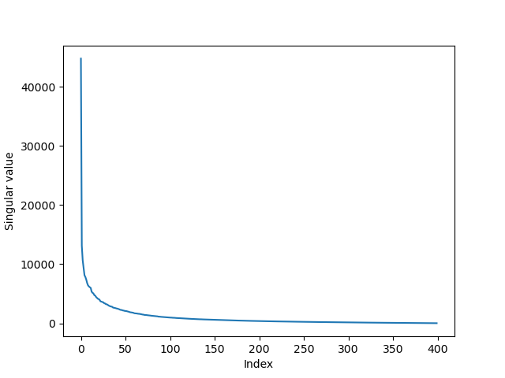
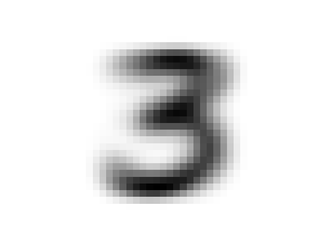
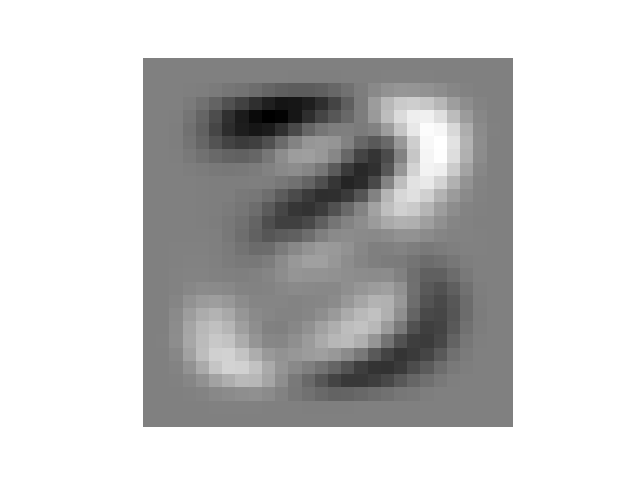
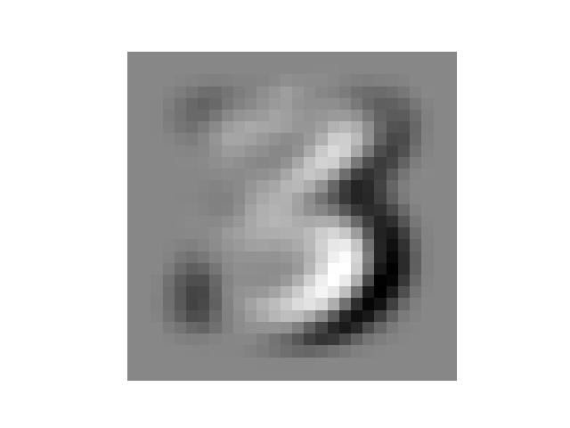
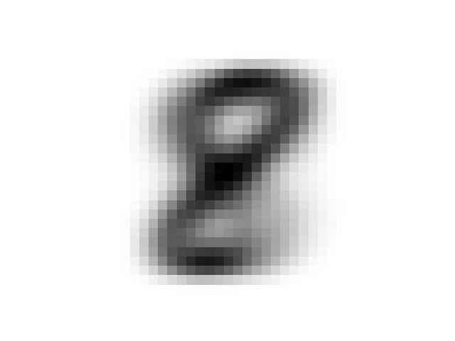
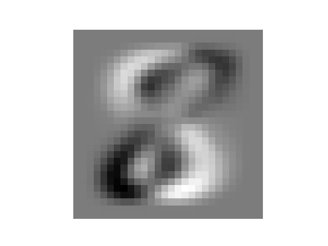
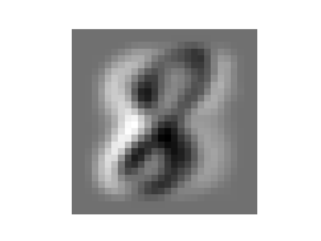
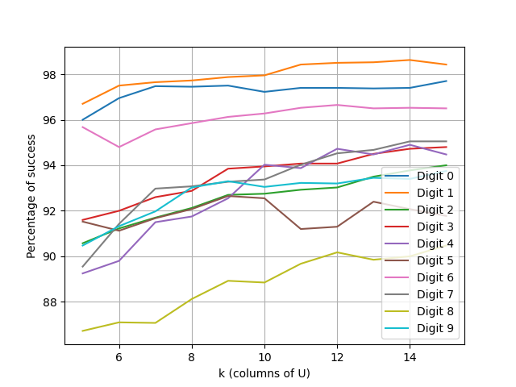

### Task 2 — Results
- For digits 3 and 8, the singular values decay rapidly → low effective rank.
- Leading singular images capture the prototype digit; subsequent modes capture systematic handwriting variations.

| Singular values $A_3$ | Singular values $A_8$ |
| --- | --- |
|  |  |

**Digit 3 — first three singular images**

| $u_1$ | $u_2$ | $u_3$ |
| --- | --- | --- |
|  |  |  |

**Digit 8 — first three singular images**

| $u_1$ | $u_2$ | $u_3$ |
| --- | --- | --- |
|  |  |  |

---

### Task 3 — Results
- One SVD basis per digit using the top $k$ left singular vectors ($k=5\ldots 15$).
- Classification by smallest projection residual; per-digit accuracy increases with $k$ and then plateaus.

